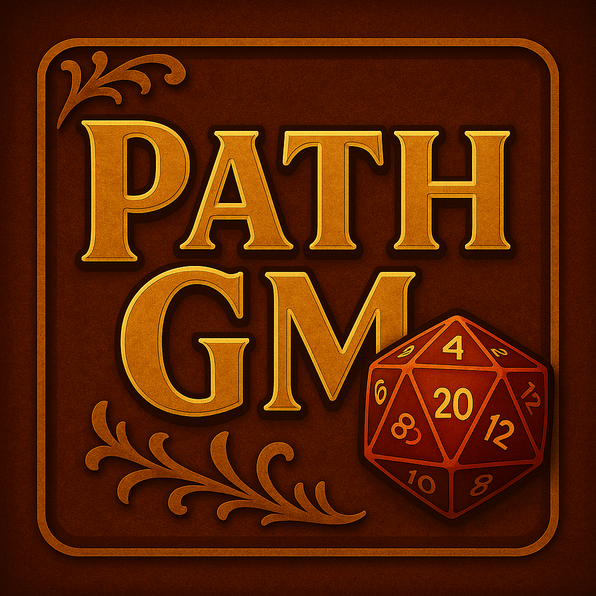

  

# 📚 PathGM Docs

Official documentation for [PathGM](https://t.me/PathGM_Bot), an AI-powered assistant bot for Pathfinder 2e Game Masters on Telegram.

> Built and maintained by José Medeiros  
> 📬 Contact: jmedeiros.neto@gmail.com

---

## 🔗 Live Site

📖 Access the documentation at:  
👉 **[https://joseneto.github.io/pathgm-docs](https://joseneto.github.io/pathgm-docs)**

---

## 🧠 What is PathGM?

PathGM is a Telegram bot designed to help Game Masters manage campaigns, create rich content, and speed up session prep — all tailored to **Pathfinder 2e Remaster**.  
It leverages **AI-powered commands** to generate high-quality lore, characters, and encounters in seconds.

---

## ⚙️ Key Features

- Generate NPCs, plots, encounters, villages, and more with AI
- Manage characters and import directly from Pathbuilder 2e
- Store notes, lores, and game hooks interactively
- Intuitive Telegram-based interface with multi-language support
- Credit system to manage usage fairly

---

## 🧙 About this Repository

This repo contains the bot's documentation files:

- `index.md` — Welcome and overview
- `comandos.md` — Full command list and usage examples
- `_config.yml` — Jekyll config
- `player-json-id.jpeg` — Pathbuilder visual guide

---
