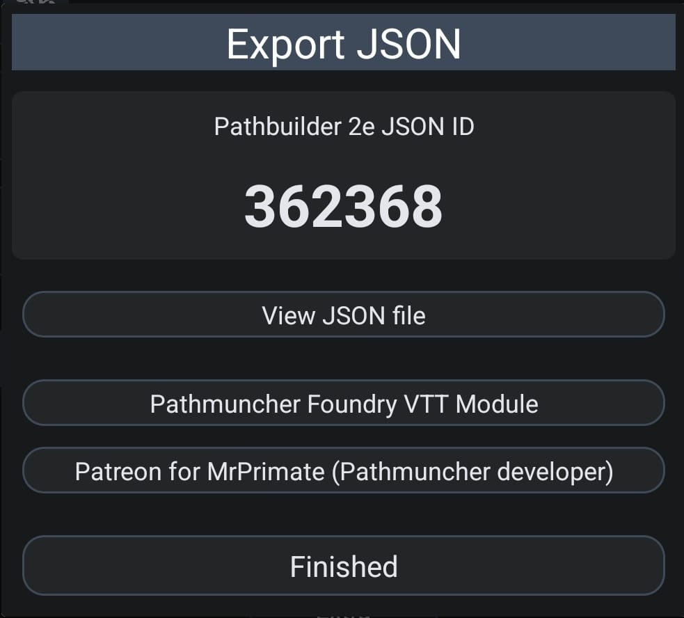

# 📜 PathGM – Commands Overview

## 🎭 Characters & NPCs
- `/npc` – Create an NPC (friendly or enemy)
- `/listnpcs` – List saved NPCs

## ✍️ Notes & Lore
- `/addnote` – Create a campaign note
- `/listnotes` – List notes
- `/lore` – Create custom lore
- `/listlores` – List lore entries

## 📖 Plot Hooks
- `/plot` – Generate a plot with hook and twist
- `/listplots` – View saved plots

## ⚔️ Encounters
- `/encounter` – Create a combat encounter (terrain + level)
- `/listencounters` – List saved encounters

## 🏘️ Villages
- `/generatevillage` – Create a detailed fantasy village
- `/listvillages` – View saved villages

## 🎲 Players & Rolls

### `/addplayer`

Adds a player character using their Pathbuilder 2e JSON ID.  
To find it:

1. Open the character in the Pathbuilder 2 app.  
2. Tap **"Export JSON"**  
3. Copy the number under **"Pathbuilder 2e JSON ID"**

📷 Example:


Then use:

```
/addplayer 362368
```

You can also add a custom name or alias:

```
/addplayer 362368 aldarin
```

### Other player commands

- `/updateplayers` – Sync updated stats from Pathbuilder  
- `/listplayers` – View registered players  
- `/roll` – Roll a skill or attack (e.g. `/roll ald nature`)  
  > You can use just part of the player name or alias to target the right character.  
- `/rollall` – Roll initiative for all players
- `/d20` – Flat d20 roll with optional modifier

## 🧼 Utilities
- `/cleardata` – Clear data by type (notes, NPCs, etc)
- `/menu` – Interactive menu
- `/about` – Info about the bot
- `/help` – View full documentation and examples
- `/credits` – Check your available AI credits

---

## 🤝 Group Commands

These commands are available when using the bot in a group:

- `/addplayer`
- `/updateplayers`
- `/listplayers`
- `/roll`
- `/rollall`
- `/d20`
